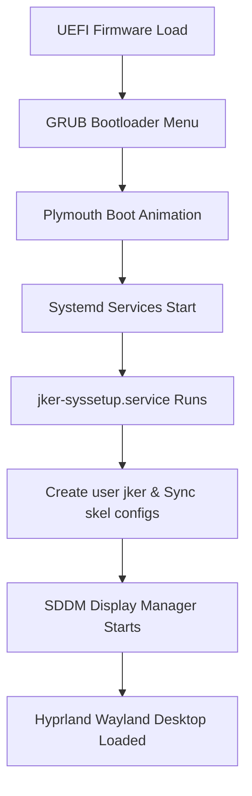
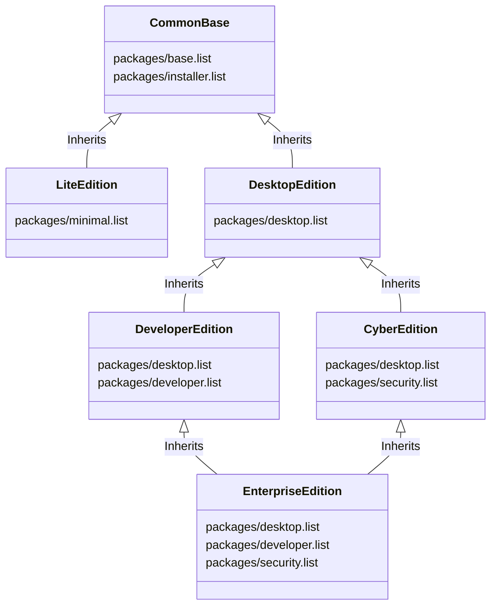

# JKER OS // System Architecture

This document describes the directory blueprint, package management strategy, multi-edition hierarchy, boot initialization flow, and design system specifications defining JKER OS.

---

## 1. Directory Blueprint

The JKER OS repository structure is completely modular, separating configuration logic from execution binaries:

*   `configs/`: Source directory for modular window manager and workspace configuration overlays.
    *   `hypr/`: Hyprland compositor configurations.
    *   `waybar/`: Desktop panels, module layouts, and styles.
    *   `swaync/`: Tactical notification center theme stylesheets.
    *   `kitty/`: Kitty terminal fonts and colors.
    *   `rofi/`: Application launcher search layouts.
    *   `dunst/`: Desktop fallback notification banners.
*   `themes/`: Source folder containing branding visual assets.
    *   `sddm/jker-sddm/`: SDDM tactical login theme.
    *   `plymouth/jker-spinner/`: Plymouth boot splash spinner.
    *   `grub/jker-grub/`: GRUB themed boot manager screen.
*   `branding/`: Distribution logotypes and desktop backgrounds.
    *   `backgrounds/camo_red.jpg`: High-quality custom generated tactical camo background.
*   `packages/`: Package list manifests defining the package profiles for custom distribution editions.
*   `applications/`: Native security, key management, and hardware diagnostic applications built in Python & PyQt6.
    *   `blackvault/`: Vault encryption mechanics and password manager.
    *   `sentryops/`: Active network threat diagnostics scanner.
    *   `downloadcenter/`: Software store package installer logs.
    *   `controlcenter/`: Power profile switcher and user accounts configuration.
    *   `wallpapermanager/`: Desktop background manager grid.
*   `installer/`: System installation engines.
    *   `gui_installer.py`: PyQt6 visual wizard installation interface.
    *   `install_helper.sh`: Low-level CLI block disk partition and bootstrap routine.
*   `archiso/`: Core ArchISO build profile.
    *   `profiledef.sh`: Custom file systems privileges permissions mapping.
    *   `packages.x86_64`: Dynamically generated packages compilation list.
    *   `pacman.conf`: System repositories definitions (core, extra, multilib).
    *   `airootfs/`: Live system overlay overlay folder containing target system shell wrappers and oneshot services.

---

## 2. Boot Initialization Flow

The live boot process is fully automated from UEFI firmware to the graphical login session:

1.  **GRUB Phase**: Selects standard kernel paths or safe graphic options (`nomodeset` kernel flag).
2.  **Plymouth Phase**: Displays tactical spinner splash screen during driver load.
3.  **Systemd Phase**: Starts system daemons. The custom `jker-syssetup.service` fires as a oneshot daemon before SDDM starts:
    *   Provisions standard live distribution user `jker` and sets permissions.
    *   Populates skeletal user configuration dotfiles (`/etc/skel/`) to the active `/home/jker/` space.
    *   Loads security policies (Fail2Ban log parameters, UFW blocking profiles, USBGuard hardware configuration policies).
4.  **Display Phase**: SDDM login manager triggers, reads autologin config `/etc/sddm.conf.d/autologin.conf`, and launches the `hyprland` session for `jker` automatically.

---

## 3. Package Management & Multi-Edition Hierarchy

Package dependencies are modularized using list manifests in the `packages/` directory instead of hardcoded bootstrap lists. 

*   **Lite Edition**: A minimal CLI core distribution including networking and basic administrative tools.
*   **Desktop Edition**: Adds the core Hyprland compositing stack, desktop panels, audio daemons (PipeWire), and custom GUI apps (Control Center, Wallpaper Manager).
*   **Developer Edition**: Extends Desktop with programming compilers, runtimes (Golang, NodeJS, Rust, JDK), containers (Docker, Podman), and developer settings.
*   **Cyber Edition**: Extends Desktop with a tactical cybersecurity audit suite (Nmap, Wireshark, Hashcat, Hydras, Responder) and security rules.
*   **Enterprise Edition**: Integrates developer utilities and security suites.

---

## 4. Design System Standards

The JKER visual experience follows the **Tactical Minimalist Dashboard** design system:
*   **Backgrounds**: Obsidian Black (`#0B0C10`) - used for backgrounds, cards, lists.
*   **Panels/Cards**: Carbon Gray (`#1F2833`) - provides clear structural partition borders.
*   **Foreground Text**: Cool Platinum (`#EDF2F4`) - offers crisp contrast under dark schemes.
*   **Primary Accents**: Crimson Red (`#D90429` / `#EF233C`) - used on active window borders, selected menu items, button borders, and urgent alerts.
*   **Secondary Accents**: Slate Gray (`#8D99AE`) - used for placeholders, inactive borders, and metadata info texts.
