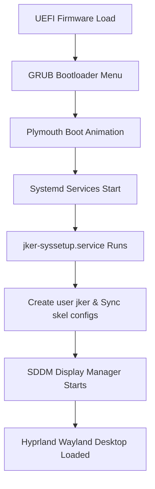

# JKER OS // System Architecture

This document describes the directory architecture, boot initialization phases, and the styling system that defines JKER OS.

---

## 1. Directory Blueprint

The repository structure follows modular distribution conventions:
* `archiso/`: Contains the primary ArchISO profile files.
  * `profiledef.sh`: Permissions, metadata and boot configurations.
  * `packages.x86_64`: Package manifest containing base system and GUI libraries.
  * `pacman.conf`: System repositories configuration.
  * `airootfs/`: The root file system overlay containing customized `/etc/` config blocks, Zsh profiles, and script binaries.
* `applications/`: Custom application codebases (BlackVault, SentryOps, Download Center, Control Center).
* `branding/`: Visual assets, SDDM layouts, GRUB boot loader skins, and Plymouth spinners.
* `installer/`: System installation routines (Calamares GUI packages and the CLI `install.sh`).
* `scripts/`: Optimization, hardware probe, and live configuration routines.

---

## 2. Boot Initialization Flow

1. **GRUB Stage**: Loads kernel parameters (e.g. modesetting variables for Nvidia probed by hardware script).
2. **Plymouth Stage**: Displays spinner animation.
3. **Systemd Stage**: Starts background services. The custom `jker-syssetup.service` triggers before SDDM starts:
   * Provisions standard live user `jker` and sets permissions.
   * Copies skel configurations to user home folders.
   * Actives system hardening frameworks (Firewalls, fail2ban, USBGuard policies).
4. **Display Stage**: SDDM launches, auto-logs into Hyprland.

---

## 3. Design System Standards

The JKER visual experience follows the **Tactical Minimalist Dashboard** design system:
* **Backgrounds**: Obsidian Black (`#0B0C10`) - used for backgrounds, cards, lists.
* **Panels/Cards**: Carbon Gray (`#1F2833`) - provides clear structural partition borders.
* **Foreground Text**: Cool Platinum (`#EDF2F4`) - offers crisp contrast under dark schemes.
* **Primary Accents**: Crimson Red (`#D90429` / `#EF233C`) - used on active window borders, selected menu items, button borders, and urgent alerts.
* **Secondary Accents**: Slate Gray (`#8D99AE`) - used for placeholders, inactive borders, and metadata info texts.
